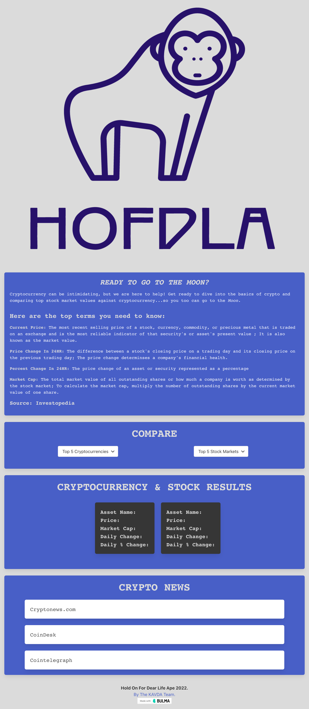

# Hold On for Dear Life Ape

## User Story:
As a stock exchange user  
I want to become educated in cryptocurrency  
So that I can invest in the crypto market

## Installation
To deploy the website please upload the folder to a webserver to allow user accessiblity.

## Usage
This site will used as the main site for Horiseon Seo marketing.

## Files & directories
Directories 
* assets
* css
* images

## Technology
* Bulma
* JaveScript
* HTML5
* Api (coingecko, finshorts)

## Acceptance Criteria:
- When the user clicks on the crypto dropdown, then the top 5 cryptocurrencies: BITCOIN, ETHEREUM, BINANCE, SOLANA, XRP can be selected.
- When the user selects a cryptocurrency from the dropdown, then the information displayed will be: percent change in 24H, price change in 24h, market cap, and current price.
- When the user clicks on the stock market dropdown, then the top 5 stocks: Tesla, Amazon, Meta, Alphabet,  and Apple can be selected.
- When the user selects a stock, then the information displayed will be: percent change in 24H, price change in 24H, market cap, current price.
- When the user selects from  the dropdown, then it will generate the information pertaining to the currency selected. 

## Deployed Project
* Repo
[HOFDLA] (https://github.com/drkevinfriday/Hold-On-for-Dear-Life-Ape)
* Website
* [HOFDLA](https://drkevinfriday.github.io/Hold-On-for-Dear-Life-Ape/)
* Full Page
* 

## License
MIT
## Contributing
Kevin Frday
Ajuli Tuck
Vanessa Maldonado
Daniel Escobedo
Albalica Espino

## Credits
Made by KAVDA